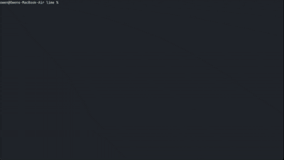

<p align="center"><strong>Codex CLI</strong> is a clean, modern terminal text editor written in Rust.</p>

<p align="center">
  
</p>

<p>It aims to be approachable like Nano, efficient and clean like Vim, and easy to use like VS Code, while keeping a standard non-modal editing model.</p>

---

## Status

This repository contains the first usable implementation:

- Rust Cargo workspace
- Rope-backed editor core
- Cursor movement and editing
- Undo/redo
- Save and save-as
- Unsaved-change prompts
- Ratatui/Crossterm terminal UI
- Status/help bars
- Recursive file picker with `Ctrl-F`
- Fuzzy file filtering
- Large-file warning policy
- Syntax highlighting for common languages with Tree-sitter/lexical fallback
- Simple TOML config loading

## Run

```bash
cargo run -p lime-cli -- path/to/file.rs
```

or after installing/building the binary:

```bash
lime path/to/file.rs
lime .
lime --force huge.log
```

## Keyboard shortcuts

| Shortcut | Action |
| --- | --- |
| `Ctrl-S` | Save |
| `Ctrl-Q` | Quit |
| `Ctrl-F` | Open file picker |
| `Ctrl-R` | Search current file |
| `Ctrl-G` | Go to line |
| `Ctrl-Z` | Undo |
| `Ctrl-Y` | Redo |
| `Ctrl-A` | Start of line |
| `Ctrl-E` | End of line |
| `Esc` | Close popup/cancel prompt |

## Config

Lime looks for config at:

- macOS: `~/Library/Application Support/lime/config.toml`
- Linux: `~/.config/lime/config.toml`

Example:

```toml
theme = "lime-dark"
tab_width = 4
insert_spaces = true
show_line_numbers = true
confirm_large_files = true
```

## Development

```bash
cargo fmt
cargo test
```

Workspace crates:

- `lime-core`: pure editor model and editing operations
- `lime-syntax`: language detection and highlighting
- `lime-ui`: terminal UI, file picker, prompts, keybindings
- `lime-cli`: binary entry point
